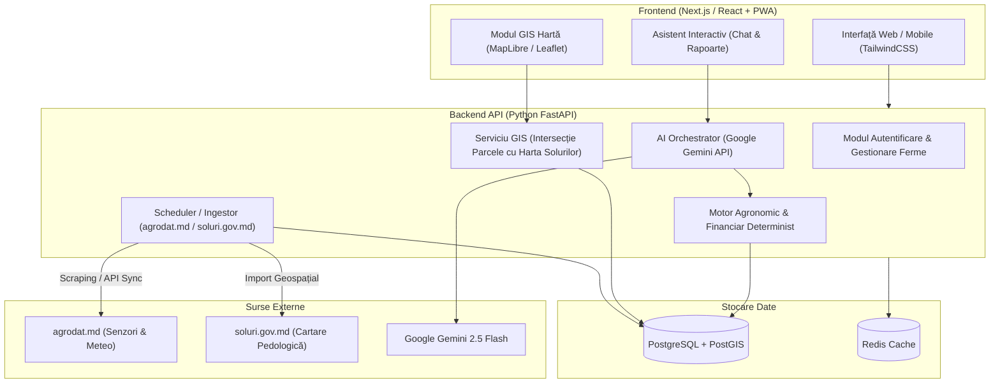

# AgriTech AI Guidance Moldova — Arhitectură Tehnică & Plan de Proiect

Un ghid decizional inteligent destinat agricultorilor din Republica Moldova, dedicat optimizării alegerii culturilor agricole, estimării randamentelor (tone/hectar), calculului costurilor de producție și maximizării profitabilității prin integrarea datelor pedoclimatice locale și a inteligenței artificiale generative.

---

## 1. Viziunea și Obiectivele Produsului

Agricultura modernă din Republica Moldova se confruntă cu riscuri climatice frecvente (secete pedologice prelungite, fluctuații termice, degradarea fertilității solului). Obiectivul platformei este să ofere fermierului un **asistent agronomic și economic digital**, capabil să transforme date brute din senzori și hărți de sol în recomandări clare, aplicabile și profitabile.

### Beneficii Cheie pentru Fermier:
* **Selecția Culturii Optime:** Corelarea tipului de sol și a climei locale cu cerințele biologice ale plantelor.
* **Predicția Producției (t/ha):** Estimarea randamentului realist pe baza notei de bonitate și a rezervei utile de apă.
* **Bilanț Financiar Transparent:** Calculul investiției per hectar (semințe, motorină, NPK, pesticide) vs. venituri estimate la prețurile pieței locale.
* **Managementul Riscurilor:** Avertizări timpurii privind seceta, înghețul târziu sau riscurile de infecții fungice bazate pe umiditatea frunzei.

---

## 2. Analiza Surselor de Date Locale

Platforma combină două surse fundamentale de date din Republica Moldova:

```
+---------------------------------------------------------------+
|                       SURSE DE DATE LOCALE                    |
+-------------------------------+-------------------------------+
|       agrodat.md              |       soluri.gov.md           |
| (Dinamica Agrometeorologică)  | (Profilul Pedologic Static)   |
+-------------------------------+-------------------------------+
| * Temperatura aerului         | * Tipul & subtipul solului    |
| * Temperatura solului (adânc) | * Conținut de humus (%)       |
| * Precipitații cumulate       | * Macronutrienți (N, P, K)    |
| * Umiditatea pe frunze        | * Nivelul pH-ului             |
| * Radiația solară             | * Gradul de eroziune / pante  |
| * Viteza & direcția vântului  | * Nota de bonitate (puncte)   |
| * Umiditatea solului          | * Textura (lutos, argilos)    |
| * Evapotranspirația (ETo)     | * Delimitări cadastrale       |
+-------------------------------+-------------------------------+
```

### Strategia de Ingestie și Normalizare:
1. **Profilul de Sol (`soluri.gov.md`):** Date cu caracter cvasi-static (se modifică lent în zeci de ani). Se importă ca straturi geospațiale (Shapefile / GeoJSON / WFS) direct în baza de date **PostgreSQL + PostGIS**.
2. **Datele Meteo & Senzori (`agrodat.md`):** Date cu frecvență ridicată (orar/zilnic). Un serviciu de fundal (Background Worker) preia telemetria stațiilor agro-meteo, o salvează într-o serie temporală și calculează medii mobile și indicatori cumulați (ex: $\Sigma T > 10^\circ\text{C}$).

---

## 3. Arhitectura Tehnică a Sistemului

Soluția optimă este o aplicație **Web Responsive (PWA)** cu arhitectură decuplată **Frontend + Backend API**:



### De ce Frontend și Backend Separat?
* **Protecția Cheilor de API:** Cheile pentru Gemini API și conexiunile la baze de date nu sunt expuse în codul clientului.
* **Calcule Geospațiale Complexe:** Determinarea solului pe baza unui contur de parcelă desenat de fermier necesită librării geodezice (`GEOS`, `GDAL`, `PostGIS`) care nu pot rula eficient în browser.
* **Performanță prin Caching:** Datele meteorologice de la stații pot fi reținute în Redis pentru a nu suprasolicita sursele externe.

---

## 4. Strategia AI: Sistem Hibrid (Determinist + LLM)

> [!CAUTION]
> **Evitarea Halucinațiilor Financiare și de Producție:**
> Un model de limbaj (LLM) apelat direct cu o întrebare liberă nu cunoaște prețul motorinei la pompă în Moldova, prețul grâului la elevator sau algoritmul pedologic de calcul al recoltei. Nu folosiți LLM-ul pentru calcule matematice directe.

### Împărțirea Rolurilor:

```
                    +------------------------------------+
                    |        DATE PARCELĂ FERMIER        |
                    +-----------------+------------------+
                                      |
                                      v
+--------------------------------------------------------------------------+
|                       MOTORUL DETERMINIST (Backend)                      |
| * Calculează intervalul realist de recoltă:                              |
|       Recoltă (t/ha) = Bonitate * Coeficient_Umiditate * Factor_Soi      |
| * Calculează devizul de cheltuieli:                                      |
|       Cost (MDL/ha) = Semințe + Îngrășăminte + Motorină + Lucrări        |
| * Calculează rentabilitatea:                                             |
|       Profit Net = (Recoltă * Preț_Piață) - Costuri_Totale              |
+--------------------------------------------------------------------------+
                                      |
                                      v [Date Structurate JSON]
+--------------------------------------------------------------------------+
|                       STRATUL COGNITIV (Gemini API)                      |
| * Sintetizează contextul într-un limbaj simplu pentru fermier.           |
| * Identifică anomalii (ex: umiditate excesivă pe frunză = risc ciuperci)|
| * Formulează recomandări de asolament (rotația culturilor pe 4 ani).     |
| * Răspunde interactiv la întrebările fermierului despre riscuri.          |
+--------------------------------------------------------------------------+
```

---

## 5. Schema Bazei de Date (Exemplu Conceptual PostGIS)

```sql
-- Parcelele fermierului (poligoane geospațiale)
CREATE TABLE parcels (
    id UUID PRIMARY KEY DEFAULT gen_random_uuid(),
    user_id UUID NOT NULL,
    name VARCHAR(100),
    cadastral_number VARCHAR(50),
    area_hectares NUMERIC(10, 2),
    geom GEOMETRY(Polygon, 4326),
    created_at TIMESTAMP WITH TIME ZONE DEFAULT NOW()
);

-- Date pedologice preluate din soluri.gov.md
CREATE TABLE soil_profiles (
    id SERIAL PRIMARY KEY,
    soil_type VARCHAR(100),       -- Ex: Cernoziom tipic moderat humifer
    humus_percentage NUMERIC(4, 2),
    bonitate_score INTEGER,        -- Ex: 78 puncte
    ph_level NUMERIC(3, 1),
    erosion_grade VARCHAR(50),
    geom GEOMETRY(MultiPolygon, 4326)
);

-- Serii temporale meteo de la agrodat.md
CREATE TABLE agro_weather_telemetry (
    id BIGSERIAL PRIMARY KEY,
    station_id VARCHAR(50),
    recorded_at TIMESTAMP WITH TIME ZONE,
    air_temp NUMERIC(4, 1),
    soil_temp_10cm NUMERIC(4, 1),
    soil_moisture_percentage NUMERIC(5, 2),
    leaf_wetness_minutes INTEGER,
    solar_radiation NUMERIC(6, 2),
    precipitation_mm NUMERIC(5, 1),
    et0_evapotranspiration NUMERIC(5, 2)
);
```

---

## 6. Fluxul Utilizatorului (User Journey)

1. **Definirea Terenului:**
   Fermierul introduce numărul cadastral sau desenează conturul parcelei direct pe harta satelit (MapLibre / Leaflet).
2. **Extragerea Automată a Datelor:**
   * Backend-ul suprapune poligonul peste straturile `soluri.gov.md` $\rightarrow$ identifică tipul de sol, pH-ul și bonitatea.
   * Backend-ul calculează distanța euclidiană până la cea mai apropiată stație `agrodat.md` $\rightarrow$ preia parametrii hidrici și termici recenți.
3. **Generarea Matricei de Rentabilitate:**
   Motorul backend analizează 5-7 culturi candidate (ex: Porumb, Grâu de toamnă, Floarea-soarelui, Rapiță, Soia, Mazăre) și calculează pentru fiecare:
   * Investiție estimată (MDL/ha)
   * Producție prognozată (min - max tone/ha)
   * Profit net estimat (MDL/ha)
4. **Raportul Asistentului AI:**
   Gemini API generează ghidul decizional nuanțat:
   * Ce cultură este pe primul loc și de ce.
   * Ce măsuri agrotehnice corective sunt necesare (ex: scarificare, corectarea pH-ului, fertilizare foliară).
   * Graficul recomandat al lucrărilor agricole.

---

## 7. Foaia de Parcurs (Roadmap de Implementare)

### Faza 1: Prototip & MVP (Săptămânile 1 – 4)
* Configurarea proiectului: **FastAPI + PostgreSQL/PostGIS + Next.js**.
* Interfață cu hartă pentru desenarea parcelei și calculul ariei în hectare.
* Șabloane statice pentru 5 culturi principale cu formule de cost și recolte de bază.
* Integrarea SDK-ului Google Gemini (`google-genai`) pentru generarea rezumatului agronomic.

### Faza 2: Conectori Automate & Date Reale (Săptămânile 5 – 8)
* Importul bazei de date a solurilor din Moldova (vectorizare / WFS de pe `soluri.gov.md`).
* Crearea modulului de ingestie a telemetriei din rețeaua `agrodat.md`.
* Corelarea indicelui de evapotranspirație cu necesarul de irigare sau rezerva de apă.

### Faza 3: Extensii Inteligente (Săptămânile 9 – 12)
* Modul multimodal Gemini Vision: fermierul poate încărca fotografii cu plantele din câmp pentru diagnosticarea bolilor și carențelor.
* Generator automat de rapoarte PDF pentru dosare de subvenționare (AIPA) sau finanțări bancare.
* Modul de asolament (istoricul culturilor pe ultimii 3 ani pentru a preveni epuizarea solului).

---

## 8. Stack Tehnologic Recomandat

* **Frontend:** Next.js (React), TailwindCSS, MapLibre GL, Lucide Icons.
* **Backend:** Python 3.11+, FastAPI, Pydantic, GeoPandas / Shapely.
* **Bază de Date:** PostgreSQL 16 cu extensia PostGIS.
* **Cache / Cozi:** Redis + Celery sau RQ (pentru sincronizarea datelor din senzori).
* **Model AI:** Google Gemini 2.5 Flash (via `google-genai` Python SDK).
